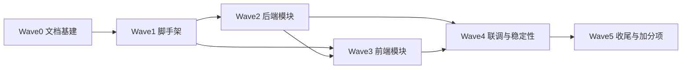

# CLUSTERS.md — 集群配置与原子提示词（Wave 编排）

> 本文件定义本项目集群开发模式下的全部波次、集群划分、每个集群的**原子任务清单**与**可直接投放使用的集群提示词**。
> 主 Agent 按波次放行：**Wave 0 → 1 → 2 → 3 → 4 → 5**，波次内集群并行，波次间验证通过才放行。

## 0. 波次总览与依赖



| 波次 | 集群 | 内容 | 模式 |
|------|------|------|------|
| Wave 0 | C0.1~C0.5 | 架构/接口/数据/交付文档 + 二次开发 Skill | 并行 |
| Wave 1 | C1.1~C1.2 | server 脚手架 + web 脚手架 | 并行 |
| Wave 2 | C2.1~C2.2 | 后端服务层 + 路由与 LLM 接入 | 并行 |
| Wave 3 | C3.1~C3.2 | 前端配置/渲染 + 答题/判题 | 并行 |
| Wave 4 | C4.1 | 端到端联调与稳定性回归 | 串行 |
| Wave 5 | C5.1~C5.2 | README/AI-CODING 定稿 + 加分项 B1/B2 | 并行 |

**通用前提（投放任何集群前）**：该集群的前置波次已验收通过；以下文件已存在：`AGENTS.md`、`docs/DATA_SCHEMA.md`、`docs/API.md`、`docs/ARCHITECTURE.md`。

---

## Wave 0 — 文档基建

### C0.1 系统架构文档

- **目标**：产出 `docs/ARCHITECTURE.md`，把架构讲清楚且与实际实现一致。
- **原子任务**：
  1. 读取 `AGENTS.md`（目录约定的服务器/前端分层）与根目录《开发流程_黑龙江省考AI出题Agent.md》第 3 节。
  2. 产出分层架构说明：前端 SPA / 后端 Express / 服务层 5 模块 / Mock双轨。
  3. 产出数据流图（mermaid）：配置+NL → parseRequirement → buildPrompt → callLLM → validate → 前端渲染 → 判题 → 解析。
  4. 产出 Agent 七步流程表（职责、输入→输出、异常处理），与根目录开发流程文档一致。
  5. 产出"扩展性设计"：如何加新题型、如何切模型、如何上量（队列化）——简短即可。
- **验收**：覆盖分层/数据流/Agent流程/异常/Mock双轨；与 CLUSTERS.md、API.md 无矛盾；代码评审级可执行。
- **禁止**：引入新架构（如改微服务）、编造组件/接口名之外的新文件。
- **集群提示词**：
  > 你是文档工程师。项目是"黑龙江省考 AI 出题 Agent"全栈 Demo（Vue3+Vite 前端、Node+Express 后端、LLM 生成+Mock 双轨）。请读取 `AGENTS.md` 和根目录《开发流程_黑龙江省考AI出题Agent.md》，生成专业级 `docs/ARCHITECTURE.md`：①分层架构+职责边界（前端 components / 后端 routes-services 分层，注明 services 含 parseRequirement、buildPrompt、callLLM、validateQuestions、mockData）；②mermaid 数据流图（用户 → 前端 → POST /api/generate → 需求解析 → Prompt → LLM(超时重试) → 校验修复(≤2次) → Mock兜底(mock:true) → 前端渲染(答案隐藏) → 答题 → 判题 → 解析展示）；③Agent 七步流程职责表（每步输入→输出→异常处理）；④Mock/真实双轨机制说明；⑤扩展设计（加题型/换模型/上量队列化）。输出必须与 `docs/API.md`、`docs/DATA_SCHEMA.md` 约定一致（这些文件由并行集群生成，若尚未存在按本文件第 2 节定义结构写作）。不要创建任何代码文件。完成后报告：文件路径、章节清单、与 CLUSTERS.md 的一致性检查结果。

### C0.2 接口与数据规范文档

- **目标**：产出 `docs/API.md` 与 `docs/DATA_SCHEMA.md`。
- **原子任务**：
  1. 从根目录《开发流程_黑龙江省考AI出题Agent.md》第 3.3/3.4 节提取权威定义（接口表与 JSON Schema 示例）。
  2. `docs/DATA_SCHEMA.md`：定义 `GenerateRequest`、`GenerateResponse`、`Question` 逐字段（类型/必填/说明）、校验规则（answer∈{A,B,C,D}、options 恰为 A-D 四键）、错误响应统一格式 `{error:{code,message}}`。
  3. `docs/API.md`：`GET /api/health`、`POST /api/generate`、`POST /api/explain`（含请求/响应示例、错误码表：400/500/408/503）。
- **验收**：字段级说明齐全；示例可直接复制用于联调；错误码与 Wave 4 回归项对应。
- **禁止**：更改 Schema 语义（保持任务书 JSON 结构）；将 `answer` 描述成"渲染到前端可见层"。
- **集群提示词**：
  > 你是接口与数据规范工程师。读取根目录《开发流程_黑龙江省考AI出题Agent.md》第 3.3 节接口表和第 3.4 节 JSON 示例。产出两份文档：①`docs/DATA_SCHEMA.md`：权威数据模型——GenerateRequest{requirement?,exam?,subject?,module?,difficulty?,count?,context?}、GenerateResponse{mock,exam,subject,module,difficulty,questions[]}、Question{id,question,options{A-D},answer,analysis,knowledgePoint}，逐字段说明类型/必填/取值/校验规则（answer 必须∈{A,B,C,D} 且与 options 键一致），统一错误格式{error:{code,message}}；②`docs/API.md`：GET /api/health、POST /api/generate、POST /api/explain 三个接口（方法/路径/请求体示例/成功响应示例/错误码表 400 参数错、408/503 模型超时或不可用、500 未知）。约定：`answer` 属后端校验与判题用，前端渲染层不得直接展示（在 Schema 中注明）。不要创建代码文件。完成后报告两份文件路径与章节清单。

### C0.3 README 骨架

- **目标**：产出 `README.md` 的完整骨架（任务书第十一节逐项覆盖），后续波次按进度填充。
- **原子任务**：
  1. 任务书要求项：项目简介 / 技术栈 / 安装启动（server+web 双端）/ 环境变量表 / 模型调用位置与配置 / Agent 流程流转 / 当前已完成 / 未完成 / 已知限制。
  2. 环境变量表：`LLM_API_KEY`、`LLM_BASE_URL`、`LLM_MODEL`、`PORT`（默认 3001）。
  3. "模型状态：真实 API / Mock" 位置预留。
- **验收**：照 README 能从零启动；所有章节齐全，未完成项标注"待填充"而非编造。
- **禁止**：声称已实现的功能未实现；写入不存在于仓库的文件路径。
- **集群提示词**：
  > 你是交付文档工程师。依据任务书（根目录《全栈开发测试任务_黑龙江省考AI出题Agent_3小.docx》已由主代理整理到《开发流程_黑龙江省考AI出题Agent.md》第 5.2 节）产出 `README.md` 骨架：项目简介（一句话+核心链路）、技术栈（Vue3+Vite / Node+Express / LLM+Mock 双轨）、目录结构速览、安装与启动（server: npm install && npm run dev 端口3001；web: npm install && npm run dev 端口5173 代理/api）、环境变量表（LLM_API_KEY/LLM_BASE_URL/LLM_MODEL/PORT，注明 .env 模板位置 server/.env.example）、模型调用位置（server/src/services/callLLM.js）与替换方式、Agent 流程流转（七步简述）、Mock 模式说明、"当前进度：Wave N 进行中（具体模块待定稿时填写）"。所有为实现/未完成内容一律写"待填充"，不得虚构。不要创建代码文件。完成后报告文件路径与章节清单。

### C0.4 AI-CODING 骨架

- **目标**：产出 `AI-CODING.md` 骨架（任务书要求：工具清单、任务拆法、AI/人工分界、AI 错误修正、再给 1 天的优先级）。
- **原子任务**：按任务书第十一节第 4 点逐项给出小节框架与"填写指引"（哪一步完成后由谁填什么内容）。
- **验收**：五个必答点全覆盖；有明确的"验收时记录"打卡位（如：AI 出过的错、发现方式、修正方式）。
- **集群提示词**：
  > 你是 AI 协作流程记录专家。产出 `AI-CODING.md` 骨架，必须覆盖任务书要求的五部分并给出填写指引：①使用的 AI 工具/模型清单；②任务如何拆成开发步骤（引用 docs/CLUSTERS.md 的波次）；③哪些部分主要由 AI 生成 vs 人工设计（如：脚手架/正则解析=AI，校验四层设计与 Mock 兜底=人工，注明"完成开发后在对应小节补真实记录"）；④AI 出现过什么明显错误、怎么发现并修正（开发过程中由主代理/开发者实时补录到"AI 错误记录表"：时间/错误/发现方式/修正）。⑤若再给 1 天优先改什么（预留：加分项 B1~B7 与上量架构）。每节给出填空模板。要真实可复盘，禁止编造已发生的 AI 错误。不要创建代码文件。完成后报告文件路径与章节清单。

### C0.5 二次开发 Skill

- **目标**：产出项目级技能 `.agents/skills/hlj-kaoqa-dev/SKILL.md`，让后续 AI（含新会话）快速复用本项目开发约束。
- **原子任务**：SKILL.md 包含：Frontmatter（name/description 触发场景）、项目一句话、快速启动命令、模块开发流程（读 AGENTS.md → 查 CLUSTERS.md → 定位模块 → 开发 → 原子验证 → 更新文档）、新题型接入步骤（在 mockData 加数据 + prompt 模块样例 + 配置下拉项 + Schema 不变）、模型切换步骤、验证清单速查、文档义务清单。
- **验收**：一个"零上下文"的 AI 按该 Skill 即可在本仓库完成一次"给数量关系模块加 Mock 数据并新增配置选项"的任务。
- **集群提示词**：
  > 你是开发者体验工程师。生成项目技能文件 `.agents/skills/hlj-kaoqa-dev/SKILL.md`（Markdown，含 YAML frontmatter：name: hlj-kaoqa-dev；description 描述中文触发场景"开发/扩展黑龙江考AI出题Demo时加载"）。内容：①项目一句话与目录速览（server/web/docs 分层）；②快速启动命令（两端 dev + verify + build）；③标准开发循环：读 AGENTS.md → 查 docs/CLUSTERS.md 当前波次 → 定位模块 → 原子开发 → 按 AGENTS.md §5 验证 → 同步文档；④"新增一个题型模块"分步指南（示例：数量关系——mockData.js 增加该模块题目数组、buildPrompt.js 模块样例段、前端配置下拉加选项、跑 verify 与 build）；⑤"切换真实模型"分步指南（填写 .env 三个变量、callLLM 使用 OpenAI 兼容协议、验证 mock:false 生效）；⑥错误自查表（非法 JSON→validate 修复重试→Mock；答案提前暴露→检查渲染层剥离）。不要创建代码文件（SKILL.md 除外）。完成后报告文件路径与目录结构。

---

## Wave 1 — 工程脚手架

### C1.1 server 脚手架

- **前置**：Wave 0 已交付。
- **目标**：`server/` 可运行的 Express 骨架（ESM）。
- **原子任务**：
  1. `server/package.json`：`"type":"module"`，scripts：`dev`(node --watch src/index.js)、`start`、`verify`(node scripts/verify-services.js)，依赖 express、cors、dotenv。
  2. `server/.env.example`：`PORT=3001`、`LLM_API_KEY=`、`LLM_BASE_URL=`、`LLM_MODEL=`，带注释。
  3. `server/src/config/env.js`：读 env + 默认值（不抛错，Key 可缺省）。
  4. `server/src/index.js`：express + cors + express.json() + 挂 `/api/health`、`/api/generate`、`/api/explain` + 全局错误中间件（统一 {error:{code,message}}）+ 404 处理；路由文件用占位实现返回 501。
  5. `server/src/routes/generate.js`、`explain.js` 占位骨架（调用 services 的注释位置已留）。
  6. `server/src/services/mockData.js` 最小版（1 个模块 1 道题，格式严格符合 DATA_SCHEMA）。
- **验收**：`npm install && npm run dev` 后 `curl localhost:3001/api/health` 返回 `{"ok":true}`；`curl -X POST localhost:3001/api/generate -d '{}' -H 'content-type: application/json'` 返回 501 占位 JSON 且不崩溃。
- **禁止**：补全真实生成逻辑（属于 Wave 2）；新增依赖超额（express、cors、dotenv 即可）。
- **集群提示词**：
  > 你是 Node 后端工程师。创建 `server/` 脚手架（ESM，Node 18+）：package.json（type:module；scripts dev=node --watch src/index.js、start、verify；依赖仅 express/cors/dotenv）、.env.example（PORT=3001、LLM_API_KEY=、LLM_BASE_URL=、LLM_MODEL=，中文注释）、src/config/env.js（读取环境变量并给默认值，Key 缺省不报错）、src/index.js（express+cors+json 中间件，挂载 /api/health 返回 {ok:true}，挂载 /api/generate 与 /api/explain 占位路由，全局错误中间件返回统一格式 {error:{code,message}}，404 兜底）、src/routes/generate.js 与 explain.js（占位实现，返回 501 JSON，注释注明 Wave 2 将接入 services）、src/services/mockData.js（最小 Mock：模块"资料分析"1 道题，格式严格符合：{exam,subject,module,difficulty,count,questions:[{id,question,options:{A,B,C,D},answer,analysis,knowledgePoint}]}）。验收：npm install 后 npm run dev 启动，curl /api/health 得 {"ok":true}，POST /api/generate 空体得 501 且服务不崩溃（可临时前台运行验证后关停）。完成后报告：文件清单、health 与 generate 的 curl 实测输出。

### C1.2 web 脚手架

- **前置**：Wave 0 已交付；C1.1 并行进行（本集群不依赖）。
- **目标**：`web/` Vite+Vue3 工程 + 页面骨架与布局容器。
- **原子任务**：
  1. Vite + Vue3 工程（`npm create vite` 等价产物：package.json、vite.config.js、index.html、src/main.js、src/App.vue）。
  2. `vite.config.js`：dev server 端口 5173，`/api` 代理到 `http://localhost:3001`。
  3. `src/api/client.js`：唯一请求入口，封装 `postJSON(path, body)`（fetch、错误归一化为 {error:{code,message}}、超时）。
  4. `src/App.vue`：三区块布局——顶部标题栏（含 Mock 状态徽标）、左侧配置区《ConfigForm》、下方题目区《QuestionCard 列表》+结果区《ResultPanel》占位；样式基线（简洁、移动端可看）。
  5. 占位组件 `ConfigForm.vue`、`QuestionCard.vue`、`ResultPanel.vue`（props 骨架 + 注释标注 Wave 3 实现）。
- **验收**：`npm install && npm run dev` 启动；`npm run build` 零错误；页面标题与三区块可见。
- **禁止**：实现实际交互逻辑（Wave 3 做）；引入 UI 框架（本次基线不引 Element/Antd，除非后续证明必要）。
- **集群提示词**：
  > 你是前端工程师。在 `web/` 创建 Vue3+Vite 工程骨架：package.json（vue、@vitejs/plugin-vue、vite；scripts dev/build/preview）、vite.config.js（端口5173，server.proxy '/api'→http://localhost:3001）、index.html（中文 title"黑龙江省考 AI 出题 Agent"、lang=zh-CN）、src/main.js、src/App.vue（三区块布局：标题栏+Mock 状态徽标默认"Mock 模式"、左侧或顶部 ConfigForm 配置/输入区、下方题目列表区(QuestionCard 列表)+右侧结果区(ResultPanel)；基础 CSS 变量与简洁样式）、src/api/client.js（封装 postJSON(path,body,timeoutMs=30000)：fetch 包装、非 2xx 归一化为 {error:{code,message}}、AbortController 超时）、占位组件 src/components/ConfigForm.vue（props: loading, submitting 空实现 + 注释 Wave3 实现）、QuestionCard.vue、ResultPanel.vue（骨架 + 注释）。验收：npm install 后 npm run dev 正常起（可前台验证后停），npm run build 零错误。完成后报告：文件清单、build 输出、页面骨架说明。

---

## Wave 2 — 后端模块

### C2.1 服务层四件套（parse/prompt/validate/mock）

- **前置**：C1.1 验收通过。
- **目标**：四个 services 模块真实实现 + 原子验证脚本。
- **原子任务**：
  1. `parseRequirement.js`：正则关键词 → {exam,subject,module,difficulty,count}；模块别名表（"资料分析/资料/资分"等）；难度映射；题量提取（"3道/5题"）；默认值（黑龙江省考/行测/资料分析/中等/3）；显式表单字段优先；模块白名单校验落到 5 大模块。
  2. `buildPrompt.js`：组装系统提示词——公考出题人角色、模块专属样例与知识点范围（资料分析：基期/现期/同比环比/增长率/比重/平均数/倍数）、JSON Schema 输出要求、质量约束（4 选项、唯一答案、解析与答案一致、禁编造政策）、"仅输出 JSON"指令。
  3. `validateQuestions.js`：四层校验——①剥 JSON 块与 parse；②结构字段（exam/subject/module/difficulty/questions 数组非空）；③逐题：question 非空、options 恰为 A/B/C/D 四键、answer∈{A,B,C,D} 且与 options 键一致、analysis 非空、knowledgePoint 可缺省但应存在；④一致性检查（answer 指向的选项文本非空、题干含数字类常识不做深度校验）；返回 {ok, questions, errors[]}；提供轻微修复（answer 写 "C " 修成 C 等）。
  4. `mockData.js`：覆盖 ≥3 模块（资料分析/判断推理/言语理解）各 ≥3 道，格式严格符合 DATA_SCHEMA，难度混合，答案解析自洽（不许自己前后矛盾）。
  5. `scripts/verify-services.js`：Node 断言脚本，覆盖：parse 命中/未命中/表单覆盖；validate 合法/非法 JSON/缺字段/坏答案/修复；mock 数据结构完整；buildPrompt 含 Schema 与模块知识。
- **验收**：`npm run verify` 全绿；`parseRequirement("我黑龙江省考资料分析比较差，给我出3道中等难度的增长率题")` 输出含 module=资料分析、count=3、difficulty=中等。
- **禁止**：在本集群写路由或调用真实 LLM；mock 数据与校验规则冲突。
- **集群提示词**：
  > 你是 Node 后端工程师，实现服务层 4 个模块（无真实 LLM 调用，路由已由脚手架占位）：①`server/src/services/parseRequirement.js`——NLU 需求解析：用正则+别名表识别 考试地区/科目/模块/知识点/题量/难度（示例输入"我黑龙江省考资料分析比较差，给我出3道中等难度的增长率题"→{exam:"黑龙江省考",subject:"行测",module:"资料分析",difficulty:"中等",count:3}），缺省默认值{黑龙江省考,行测,资料分析,中等,3}，显式字段覆盖 NL 结果，module 白名单校验（言语理解与表达/判断推理/数量关系/资料分析/常识判断）。②`server/src/services/buildPrompt.js`——组系统提示词：出题人角色+模块知识点范围（资料分析含基期现期/同比环比/增长率/比重/平均数/倍数；判断推理含定义判断/类比推理/逻辑判断；言语理解含主旨概括/意图判断/逻辑填空/语句排序）+严格输出 JSON Schema（符合 docs/DATA_SCHEMA.md）+质量约束（四选项唯一答案、解析一致、禁编造黑龙江政策）+仅输出 JSON。③`server/src/services/validateQuestions.js`——四层校验：剥 JSON 块与 parse(兼容 ```json 围栏)→结构字段→逐题字段（question 非空、options 恰有 A-D 四键、answer∈{A,B,C,D} 且与 options 键一致、analysis 非空、knowledgePoint 可缺省）→轻微修复（首尾空白等）；返回{ok,questions,errors}。④`server/src/services/mockData.js`——≥3 模块×≥3 道题，格式严格符合 Schema，答案与解析自洽。⑤`server/scripts/verify-services.js`——node 断言脚本全量验证以上 4 模块（含：解析命中/缺省/表单覆盖、校验合法/非法/坏题/修复、Mock 完整性、Prompt 含 Schema）。验收：`npm run verify` 全部断言通过并打印 PASS 汇总。禁止在该集群写路由/调真实 LLM。完成后报告：各模块实现要点 + verify 执行输出。

### C2.2 路由接入与 LLM 调用

- **前置**：C2.1 验收通过。
- **目标**：`callLLM.js` + `/api/generate` 真实闭环 + `/api/explain`（B3 预留、可实测 mock 解释）。
- **原子任务**：
  1. `callLLM.js`：OpenAI 兼容协议（base_url + /chat/completions），fetch + AbortController 超时（30s）+ 失败重试 1 次 + 统一抛错；无 Key 直接抛"未配置"类错误供上层走 Mock。
  2. `routes/generate.js`：接收 body → parseRequirement（表单字段合并）→ buildPrompt → callLLM → validateQuestions（重试 ≤2 次，仍失败 → mockData 兜底 mock:true）→ 响应 GenerateResponse；catch 一切 → Mock 兜底并 mock:true；context 字段透传（B2 预留，只透传+提示词加"风格延续、命题不重复"）。
  3. `routes/explain.js`：无 Key 时用模板生成通俗解释（基于 question/analysis 重述），有 Key 调 LLM；返回 {explanation}。
- **验收**：无 Key 环境 `POST /api/generate` 返回 mock:true 且 questions 数组完整；非法 JSON 输入仍返回结构化响应（mock 兜底或 400 均不白屏）；`POST /api/explain` 返回 {explanation} 非空。
- **禁止**：Key 泄露（只读 env）；在 route 内嵌大段业务逻辑（全部走 services）。
- **集群提示词**：
  > 你是 Node 后端工程师，接入模型调用与核心路由（前置：C2.1 服务层已实现并验收）。①`server/src/services/callLLM.js`：OpenAI 兼容 POST {base}/chat/completions，系统提示+用户消息，fetch+AbortController 30s 超时、失败重试 1 次（指数退避）、统一抛 Error（区分：未配置 Key / 超时 / HTTP 异常 / 网络异常）；未配置 Key 立即抛"未配置"。②`server/src/routes/generate.js`：完整七步组装——解析参数（body 显式字段覆盖 parseRequirement 的 NL 结果）→buildPrompt→callLLM→validateQuestions（失败反馈重生成 ≤2 次）→成功返回 {mock:false,...}；任何 catch 与校验最终失败 → 用 mockData 兜底返回 {mock:true,...}（响应始终是合法 GenerateResponse，结构见 docs/DATA_SCHEMA.md）；body.context 存在时透传并在提示词中加"保持与上题同知识点同难度、命题不重复"（为加分项 B2 预留）。③`server/src/routes/explain.js`：无 Key 用模板通俗化重写 analysis 返回 {explanation}；有 Key 调 LLM 生成"更通俗的大白话讲解"。④保持全局错误中间件统一格式。验收（无 Key 环境实测）：POST /api/generate 空体 → mock:true 且 questions 字段齐全；POST /api/generate 带自然语言 requirement → 返回合法 JSON（mock:true）；POST /api/explain → {explanation} 非空；连续 5 次请求服务稳定。禁止在 route 里堆业务逻辑；禁止任何位置打印或暴露 API Key。完成后报告：实现要点 + 三接口 curl 实测输出 + mock:true 证据。

---

## Wave 3 — 前端模块

### C3.1 配置输入与题目渲染

- **前置**：Wave 2 验收通过。
- **目标**：ConfigForm 真实交互 + QuestionCard 渲染（答案隐藏）。
- **原子任务**：
  1. `ConfigForm.vue`：地区(固定"黑龙江省")、考试(固定"省考")、科目(固定"行测")、模块下拉（5 类）、难度下拉（简单/中等/困难）、题量（1-10 步进）、自然语言文本框（textarea）、"生成题目"按钮（submitting 防重复 + disabled + loading 文案）；提交时构建请求体：显式字段 + requirement。
  2. `QuestionCard.vue`：渲染题干、A-D 选项（单选可点选高亮）、知识点标签、答案区域隐藏——**渲染层彻底剥离 answer/analysis**（组件只接收 id/question/options/knowledgePoint）。
  3. `App.vue` 组装：加载态（生成中"解析需求→调用模型→校验题目"步骤指示）、错误态（从 client 拿 {error:{code,message}} 展示 + 重试按钮）、Mock 徽标（mock 为真时显示"Mock 模式"）。
- **验收**：浏览器可选择配置/输入需求 → 点击生成 → 展示题目列表；DOM 中不存在 answer 文本（审查元素验证）。
- **禁止**：在 QuestionCard 中接收或渲染 answer/analysis；组件直连 fetch（必须经 api/client.js）。
- **集群提示词**：
  > 你是 Vue3 前端工程师，实现配置与渲染模块（后端已就绪，/api/generate 可用）：①`src/components/ConfigForm.vue`——出题配置表单：地区/考试/科目为固定值(黑龙江省/省考/行测，只读展示)，模块下拉（言语理解与表达/判断推理/数量关系/资料分析/常识判断）、难度下拉（简单/中等/困难）、题量 1-10（数字输入+步进）、自然语言需求 textarea（placeholder 示例"我黑龙江省考资料分析比较差，给我出3道中等难度的增长率题"）、"生成题目"按钮：submitting 时 disabled 且文案"生成中…"，防重复提交；emit('submit', {form, requirement})。②`src/components/QuestionCard.vue`——题卡：题干、A/B/C/D 选项（可点选、选中高亮、禁选中后不可再次点选）、右上角知识点标签；**props 只收 {id,question,options,knowledgePoint}，answer 与 analysis 严禁传入组件**；emit('select',{id,option})。③`src/App.vue` 组装：调用 api/client.js 的 postJSON('/api/generate', body) 与 postJSON('/api/explain',…)，生成中显示三步骤加载指示（解析需求→调用模型→校验题目），错误显示 {error.message}+重试按钮，mock:true 时显示"Mock 模式"徽标；题目列表用 QuestionCard 渲染。验收：npm run dev 后在浏览器完成"选择/输入→生成→题目渲染"全流程；用浏览器审查元素确认 DOM 中无答案文本（"【答案】"/正确答案字母不出现在选项以外区域）。完成后报告：组件清单、交互流程、DOM 无答案暴露的验证说明、build 结果。

### C3.2 答题判题与结果面板

- **前置**：C3.1 验收通过。
- **目标**：作答交互 + 判题展示 + 结果汇总 + 学习记录（localStorage，B4 前置）。
- **原子任务**：
  1. 作答状态管理：逐题作答列表（questionId → 用户答案），提交按钮"提交本组"（或逐题提交，取交互最简者——推荐整组提交）。
  2. `ResultPanel.vue`：判题结果卡片——本题正确/错误、正确答案字母+选项文本、解析（此时才展示）、本级汇总（对/错/正确率）。
  3. `analysis` 传递：提交后才把 answer/analysis 传给渲染（App.vue 持有完整数据，提交前不传）。
  4. localStorage 学习记录（模块+知识点+对错 → 统计），面板底部显示"本次正确率 + 薄弱知识点"，为 B4/B5 铺路。
- **验收**：完整作答一组（选择→提交→对错+正确答案+解析+汇总）；刷新页面统计仍在（localStorage）。
- **禁止**：提交前向界面暴露答案；跳过空答把空答记为正确。
- **集群提示词**：
  > 你是 Vue3 前端工程师，实现答题判题模块（前置：C3.1 已在 App.vue 中用 QuestionCard 渲染题目）：①在 App.vue 增加作答状态：answers 映射 {questionId: option}，禁用已选后改选或允许改选后统一提交（选择实现并说明）；"提交本组"按钮（无作答时禁用/提示）。②`src/components/ResultPanel.vue`：接收提交结果——逐题卡片：正确/错误标识、正确答案（字母+选项文本）、解析内容（**仅提交后展示**）、本组汇总（答对 X/共 Y、正确率%）；③本地统计：localStorage key `hlj-kaoqa-stats` 记录 {module, knowledgePoint, correct, total} 增量，面板展示"累计正确率 + 薄弱知识点（正确率最低的 1-2 个知识点）"。④提交前 DOM 继续保证无答案/解析文本。验收：浏览器完成"作答→提交→对错与解析→汇总展示"；刷新页面后累计统计仍在；空答不计为正确。完成后报告：交互方案说明、组件变更清单、build 结果、localStorage 结构。

---

## Wave 4 — 联调与稳定性回归

### C4.1 端到端回归

- **前置**：Wave 3 验收通过。
- **目标**：全链路走查 + 异常场景回归，产出 `docs/REGRESSION.md`。
- **原子任务**（逐项执行并记录结果）：
  1. 正常闭环：选择配置 → 生成 → 逐题作答 → 提交 → 判题+解析。✅
  2. 自然语言闭环：仅输入自然语言 → 生成 → 作答。✅
  3. 无 Key（Mock）：mock:true、界面 Mock 徽标可见。✅
  4. UI 上答案作答前不可见（审查 DOM）。✅
  5. 断网/后端停：出现错误提示 + 重试按钮，不白屏。✅
  6. 连点生成：submitting 锁生效，请求不重复爆炸。✅
  7. 坏题容错：validate 重试失败走 Mock，前端不崩。✅
  8. 前端 build、后端 verify：全绿。✅
  9. 照 README 从零启动复现。✅
- **产出**：`docs/REGRESSION.md` 记录每项实测证据（命令/日志摘要/结论）。
- **禁止**：不实测直接填"通过"；带病放行下游。
- **集群提示词**：
  > 你是 QA 工程师。对已完成的 Demo 执行端到端回归并产出 `docs/REGRESSION.md`：按 9 项清单逐项实测记录（①正常配置闭环②纯自然语言闭环③无 Key Mock+徽标④DOM 答案预暴露检查⑤后端停/断响应不白屏⑥连点生成防重⑦坏题兜底⑧npm run build、npm run verify 全绿⑨按 README 从零复现）。每项记录：操作步骤、实测证据（curl 输出/浏览器表现/build 日志摘要）、结论 PASS/FAIL。验收：9 项全部 PASS 或明确定级为已知限制（并同步到 README）。发现缺陷时：给出最小修复建议（写进 REGRESSION 相应条目），不直接大改代码，交由主代理裁决。完成后报告：每项结论一览表 + 缺陷清单（若有）。

---

## Wave 5 — 收尾与加分项

### C5.1 README / AI-CODING 定稿

- **前置**：Wave 4 通过。
- **任务**：基于真实实现填齐 README 全部章节（已完成/未完成/已知限制如实）；向开发参与记录中补 AI-CODING 真实内容（工具清单、AI 错误实例与修正——由各波次审批记录汇总）。
- **验收**：README 可复现；AI-CODING 真实可复盘。

### C5.2 加分项 B1+B2

- **前置**：Wave 4 通过。
- **任务**：B1 校验强化（validate 增加选项相似度检测与题干-答案语义一致性提示词自检）；B2 "再来一道类似的"（前端"再来一道"按钮 → /api/generate 带 context{knowledgePoint,difficulty,excludedIds} → 后端去重提示 + validate 后过滤重复题干，重复则再生成一次）。
- **验收**：连续点击"再来一道"，两次题目题干不同；知识点/难度延续。

---

## 附：集群投放清单（主 Agent 执行模板）

| 波次 | 集群 | 子代理类型 | 依赖 | 并行度 |
|------|------|-----------|------|--------|
| 0 | C0.1~C0.5 | coder | 元文档(AGENTS/CLUSTERS) | 5 并行 |
| 1 | C1.1~C1.2 | coder | Wave0 | 2 并行 |
| 2 | C2.1~C2.2 | coder | Wave1 | 2 并行 |
| 3 | C3.1~C3.2 | coder | Wave2 | 2 并行 |
| 4 | C4.1 | coder | Wave3 | 串行 |
| 5 | C5.1~C5.2 | coder | Wave4 | 2 并行 |

> 每次投放前主 Agent 校验前置验收项，投放后用对应验收标准核验产物；未通过即修（原集群 resume）再放行。