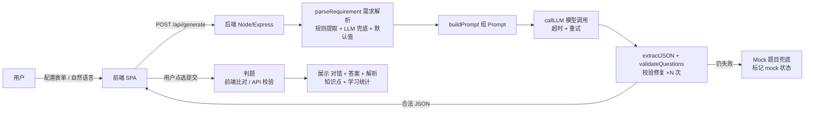
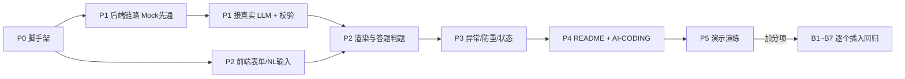

# 黑龙江省考 AI 出题 Agent — 开发流程与需求拆解

> 依据任务书《全栈开发测试任务_黑龙江省考AI出题Agent_3小.docx》拆解整理
> 定位：本项目开发前的**唯一工作文档**，覆盖 需求拆解 → 技术方案 → 时间排期 → 开发计划 → 验收标准 → 风险预案 的完整闭环

---

## 1. 项目定位

### 1.1 一句话理解任务

> 做一个"黑龙江省考 AI 智能刷题"Demo：**用户说出练习需求 → Agent 理解并出题 → 用户作答 → 系统判题并给出解析**。

### 1.2 成功的唯一标准（验收口径）

不是页面多、代码多，而是把这条核心链路真正跑通：

```
用户进入页面
   ↓
选择 / 输入练习需求（下拉配置 + 自然语言）
   ↓
Agent 理解需求（NLU：地区/考试/科目/模块/知识点/题量/难度）
   ↓
生成黑龙江省考行测题目（结构化输出）
   ↓
前端渲染题目（答案隐藏）
   ↓
用户完成逐题作答
   ↓
提交后判题（正确/错误）
   ↓
展示正确答案 + 解析
```

### 1.3 明确不做（本期排除项）

登录注册、支付、正式用户体系、完整后台、完整题库、商业级 UI、APP、复杂部署。
**宁可只做好"资料分析"一个模块，也不做多个无法真正使用的页面。**

---

## 2. 需求拆解

### 2.1 功能需求分解（基础项 = 最低闭环）

| 编号 | 需求 | 拆解要点 | 验收口径（任务书对应） |
|------|------|----------|------------------------|
| F1 | 出题配置 | 地区：黑龙江省；考试：省考；科目：行测；模块：≥3 类可选（言语理解/判断推理/数量关系/资料分析/常识判断）；难度：简单/中等/困难；题量：1～10 道 | 十一.1 |
| F2 | 自然语言输入 | 除下拉外，支持直接输入需求；需识别 地区/考试/科目/模块/知识点/题量/难度；**缺省字段用合理默认值，不得因缺字段无法使用** | 四.2 |
| F3 | 题目生成与展示 | 每道题：完整题干 + A/B/C/D 四个选项 + 唯一正确答案 + 可解释的解析 + 知识点字段（如"增长率"） | 四.3 |
| F4 | 答题与判题 | 答案在作答前**不得暴露**；点选选项并提交后显示 对/错 + 正确答案 + 解析；多题可连续作答 | 四.4 |
| F5 | Agent/Workflow | 体现真实流程：理解需求 → 定参（考试/模块/知识点/题量/难度）→ 生成 → **校验** → 结构化返回 → 判题解析展示；需能解释"为什么这样拆、每步解决什么问题、模型输出异常怎么处理" | 五 |
| F6 | 结构化输出 | 模型返回 JSON，前端渲染（非一段 Markdown） | 七 |
| F7 | 异常与稳定性 | 非法 JSON / 字段缺失 / 超时失败不白屏 / 防重复提交 / **API Key 不写死在前端** | 八 |

### 2.2 题目质量要求（生成侧约束）

- 必须具有**公考行测特征**，避免普通小学数学题、泛化常识问答：
  - 资料分析：基期量、现期量、同比/环比、增长率、比重、平均数、倍数
  - 判断推理：定义判断、类比推理、逻辑判断
  - 言语理解：主旨概括、意图判断、逻辑填空、语句排序
- 题干、选项、答案、解析之间**不得明显矛盾**
- 对黑龙江具体政策/题型规则不确定时**不编造**，使用通用行测规范，并在产品中标注 Demo 范围

### 2.3 加分项清单（优先级排序，见第 8 节）

| 加分项 | 内容 |
|--------|------|
| B1 | 生成后 Review/Check 步骤强化（选项/答案/解析/格式） |
| B2 | "再来一道类似的"二次出题 |
| B3 | "没看懂，再简单讲一遍"题目追问 |
| B4 | 记录做题数 / 正确率 / 薄弱知识点 |
| B5 | 连续答对/答错自动调整下一题难度 |
| B6 | 流式生成或明确生成过程状态 |
| B7 | 题目去重 / 简单相似度检查 |

### 2.4 MoSCoW 优先级汇总

- **Must（基础闭环）**：F1 ~ F7，即"出题配置 + NL 输入 + 生成展示 + 答题判题 + 结构化 + 基础异常"
- **Should（加分）**：B1、B2、B3（体验增强，成本低）
- **Could（加分）**：B4、B5、B6、B7
- **Won't（本期不做）**：登录、支付、完整后台、APP、商业级 UI

---

## 3. 技术方案

### 3.1 技术选型（以"最有把握 90 分钟闭环"为原则）

| 层 | 默认推荐 | 可选 | 选择理由 |
|----|----------|------|----------|
| 前端 | Vue 3 + Vite | React / Next.js | 单页即可，脚手架快，无 SSR 复杂度 |
| 后端 | Node.js + Express | Python FastAPI | 与前端同为 JS 生态，类型/JSON 处理顺手；如更熟 FastAPI 可换 |
| 模型 | DeepSeek / MiniMax / OpenAI | Claude / Gemini | 可申请 API Key；**必须留 Mock 兜底** |
| 部署 | 本地可启动即可 | Vercel / Render | 有 Demo URL 为加分，无则 README 写清启动方式 |

> 原则：**技术栈不限，选自己最熟、最快出闭环的**。不要在脚手架和部署上花超过 10 分钟。

### 3.2 系统架构与数据流



### 3.3 接口设计

| 接口 | 方法 | 请求 | 响应 | 说明 |
|------|------|------|------|------|
| `/api/generate` | POST | `{ requirement?, exam?, subject?, module?, difficulty?, count?, context? }` | `{ mock, exam, subject, module, difficulty, questions[] }` | 核心出题；`requirement` 为自然语言；`context` 用于"再来一道类似" |
| `/api/explain` | POST | `{ question, analysis, userAsk }` | `{ explanation }` | 加分项 B3 追问讲解 |
| `/api/health` | GET | — | `{ ok }` | 部署探测 |

### 3.4 数据结构（统一结构化输出）

```json
{
  "mock": false,
  "exam": "黑龙江省考",
  "subject": "行测",
  "module": "资料分析",
  "difficulty": "中等",
  "questions": [
    {
      "id": "q_1",
      "question": "题干……",
      "options": { "A": "……", "B": "……", "C": "……", "D": "……" },
      "answer": "C",
      "analysis": "解析……",
      "knowledgePoint": "增长率"
    }
  ]
}
```

`id` 由后端生成（前端渲染与判题定位用），`answer` 随题返回但不渲染，仅用于提交后比对。

### 3.5 Agent 流程设计（每步职责与异常处理）

| 步骤 | 职责 | 输入 → 输出 | 异常处理 |
|------|------|-------------|----------|
| ① 需求解析 parseRequirement | 把自然语言/表单归一化为结构化参数 | `requirement/表单` → `{exam, subject, module, difficulty, count}` | 正则关键词优先（黑龙江/省考/行测/资料分析/增长率/3道/中等）；命中不全用默认值（黑龙江省考/行测/资料分析/中等/3道）；显式表单字段**覆盖** NL 结果 |
| ② Prompt 组装 | 约束模型输出质量与格式 | 参数 + 质量规则 + JSON Schema → prompt | — |
| ③ 模型调用 callLLM | 真实出题 | prompt → 原始文本 | 超时（如 30s）/报错 → 捕获并走 Mock；可重试 1 次 |
| ④ 校验修复 validate | **保证结构化合法可用** | 原始文本 → questions[] | 剥取首个 JSON 块 → `JSON.parse` → 逐题校验：题干非空 / options 恰四键 / answer ∈ {A,B,C,D} 且与选项键一致 / analysis 非空 / answer 与题干分析无矛盾；失败补修 + 重生成重试，≤2 次后仍失败 → **Mock 兜底并标记 `mock:true`** |
| ⑤ 前端渲染 | 隐藏答案、逐题作答 | questions[] → 题卡 | 渲染前再跑一遍轻量校验，坏题跳过并提示 |
| ⑥ 判题 | 判定正误 + 展示解析 | 用户答案 vs answer | 前端本地比对；空答不视为错误 |
| ⑦ 二次交互（加分） | 类似题 / 追问 | context → ①~④ 复用 | 同上 |

### 3.6 Mock 与真实模型双轨

- `LLM_API_KEY` / `LLM_BASE_URL` / `LLM_MODEL` 走环境变量（`.env`，前端不出现）
- 无 Key 或调用异常 → 切内置 Mock 题库 JSON（资料分析等模块各备一组，格式同上），界面明示 **"Mock 模式"**
- README 说明真实模型接入点与替换方式

---

## 4. 时间评估

### 4.1 评估结论

- **任务书预算**：3 小时（约 90 分钟闭环 + 剩余时间做加分项与口头说明准备）
- **实际闭环评估**：**约 90 分钟**可完成最低闭环（基础项全绿 + Mock 可演示）
- **策略**：前 90 分钟 `只做基础项闭环`；剩余时间按第 8 节顺序做加分项；**任何时刻发现时间紧，立即回退到保闭环**

### 4.2 90 分钟执行排期（基础项）

| 阶段 | 用时 | 任务 | 产出 / 验收口 |
|------|------|------|---------------|
| P0 工程初始化 | 10 min | 前后端脚手架、目录、`.env.example`、Mock 题库、`/api/health` | `npm run dev` 双端起得来 |
| P1 后端生成链路 | 20 min | parseRequirement → buildPrompt → callLLM → validate；`/api/generate` | `curl` 返回合法 JSON；断 Key 时返回 Mock |
| P2 前端核心闭环 | 25 min | 配置表单 + NL 输入框 + 生成按钮（防重复）+ 题卡渲染 + 逐题作答 + 判题解析展示 | 浏览器手动走通"选择 → 生成 → 作答 → 判题 → 解析" |
| P3 异常与稳定性 | 15 min | 加载态/失败态/非法 JSON 提示/无 Key 提示/按钮 loading 锁 | 断网、连续点生成、缺字段题均不白屏失控 |
| P4 文档交付 | 15 min | README.md + AI-CODING.md + 自查清单 + 演示脚本 | 照 README 可复现；AI-CODING 真实可复盘 |
| P5 留白 | 5 min | 时间富余则启动 B1/B2 | — |

**合计：约 90 分钟。** 若前端经验更熟，P2 可压缩至 20 分钟，为 P4 挤出缓冲。

### 4.3 3 小时完整排期（基础 + 加分）

| 时段 | 内容 |
|------|------|
| 0:00 – 1:30 | P0 ~ P4 基础项（同上） |
| 1:30 – 1:45 | B1 Review 检查强化（校验函数更严 + 不可用题自动重生成） |
| 1:45 – 2:00 | B2 "再来一道类似的"（context 复用生成链路，提示词加去重约束） |
| 2:00 – 2:15 | B3 "没看懂，再讲一遍"（增加 `/api/explain` + 追问按钮） |
| 2:15 – 2:35 | B4 学习统计（localStorage 记录做题数/正确率/薄弱知识点，页面小面板） |
| 2:35 – 2:50 | B5 难度自适应 + B6 生成过程状态（步骤进度提示） |
| 2:50 – 3:00 | B7 相似度去重（可选）、全量回归自查、口头说明演练 |

> 每项加分独立可交付、可回退；**B1/B2/B3 优先于 B4~B7**。

---

## 5. 验收标准

### 5.1 最低闭环走查单（对照任务书第十二节）

- [ ] 项目能正常启动（README 照做可复现）
- [ ] 能选择 **或** 输入黑龙江省考练习需求
- [ ] Agent 正确理解基本需求（含缺省默认值）
- [ ] 生成的是**完整题目**（题干 + 四选项 + 答案 + 解析），不是聊天文本
- [ ] 答案在作答**前隐藏**，点选提交后显示对/错
- [ ] 判题结果正确、解析可见
- [ ] 模型/接口异常时页面有基本处理（不白屏）
- [ ] API Key 未出现在前端代码中
- [ ] README / AI-CODING 齐备

### 5.2 交付物清单

1. **完整源代码**：GitHub/Gitee 链接或 ZIP（含源码，非 build 产物）
2. **可运行 Demo**：Demo URL 或本地启动说明
3. **README.md**（必须）：实现内容 / 技术栈 / 安装启动 / 环境变量 / 模型调用位置与配置 / Agent 流程流转 / 已完成 / 未完成 / 已知限制
4. **AI-CODING.md**（必须）：用过的 AI 工具、任务拆法、AI 生成与人工设计的分界、AI 出错与修正过程、再给 1 天的改动优先级
5. **提交信息**：项目名 / 代码地址 / Demo 地址 / 启动方式 / 模型状态（真实 or Mock）/ 本次已完成 / 本次未完成

---

## 6. 风险与应对预案

| 风险 | 触发场景 | 应对 |
|------|----------|------|
| 模型返回非法 JSON | 输出被截断/夹带文字 | 剥 JSON 块 → parse → 校验修复 → 重生成 ×2 → Mock |
| 题干/选项/答案缺失 | 字段校验不过 | validate 逐字段兜底；坏题重生成，仍失败整组回退 Mock |
| API 超时/不可用 | 网络或 Key 问题 | 后端 try-catch + 超时（30s）→ Mock；前端 loading + 重试按钮 |
| 连续点生成 | 高频提交 | 按钮 disabled + 请求并发锁（前端最简单实现即可） |
| Key 泄露 | 写死前端 | Key 只存后端 `.env`，前端零感知 |
| 现场无可用 Key | 演示环境 | Mock 题库保闭环，界面明示 mock:true，README 写替换方式 |
| 编造黑龙江政策 | 超出知识范围 | 提示词禁止编造 + 使用通用行测规范 + 页面标注 Demo 范围 |
| 时间超支 | 任意阶段 | 立即压缩到"单模块 + 最简闭环"，P4 文档雷打不动 |

---

## 7. 实现顺序（Cyclic 闭环内任务依赖）



---

## 8. 加分项实施顺序（每个不依赖前一个，可独立砍掉）

1. **B1 Review/Check 强化** — 校验函数纳入 prompt 二次自检 + 坏题自动重生成（与 P1 天然衔接，几乎零成本）
2. **B2 再来一道类似** — `/api/generate` 增 `context`（知识点/难度/上次题干），提示词"风格一致、知识点相同、题干不重复"
3. **B3 追问简化讲解** — `/api/explain` 把该题解析转通俗大白话
4. **B4 学习统计** — localStorage 或后端内存：总题数、正确率、按知识点聚合薄弱项
5. **B5 难度自适应** — 连续答对 2 题升档、答错 1 题降档，重新传给生成参数
6. **B6 生成状态** — 前端展示"解析需求 → 调用模型 → 校验题目"步骤进度
7. **B7 题目去重** — 与本次会话历史题干做简单相似度（编辑距离/关键词重合）过滤，触发重生成

---

## 9. 完成后口头说明脚本（任务书第十六节）

- **Agent 具体做了什么**：需求理解 + 参数归一 + 生成 + 校验兜底，四步闭环，非"输入框+一次调用+打印"
- **如何减少错误答案/错误解析/格式错误**：JSON Schema 约束 prompt；validate 四层校验（JSON → 字段 → 答案合法性 → 一致性）；修复/重试/Mock 三级兜底
- **若每天生成大量题目**：生成与判题异步化（队列 + 工作进程），加缓存/去重（向量化相似度）、限流、题目库落库、人工抽检 Review 机制
- **3 小时最难的问题**：模型输出不稳定（非法 JSON/坏题）→ 校验-修复-兜底链路的设计与调试
- **AI Coding 帮了什么 / 哪里容易带偏**：脚手架、样板代码、正则解析提速明显；但会"顺着表面需求堆功能或过度设计"，需人工守住"先闭环、再加分"的边界